# Blog do código

1. Ajuste do package.js
2. instalação das dependência abaixo:

   npm install body-parser@1.19.0

   npm install nodemon@2.0.2

   npm install sqlite3

   npm install express@4.17.1

   npm i dotenv

   npm i bcrypt

   npm i jsonwebtoken

   npm i redis

   npm i passport

   npm i passport-local

   npm i passport-http-bearer

3. Rodar Programa com npm start
4. Implementação do bcrypt
5. Criar método static gerarSenha

   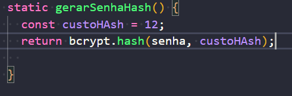

6. importar bycrpt
7. Criar um metodo de adicionaSenha dentro (./src/usuario/usuario-modelo)

   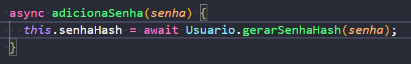

8. Incluir dentro do contructor

   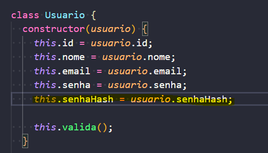   

9. criar validações

   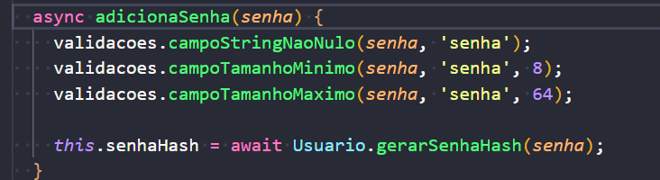

10.Refatorar arquivos usuarios-dao.js

   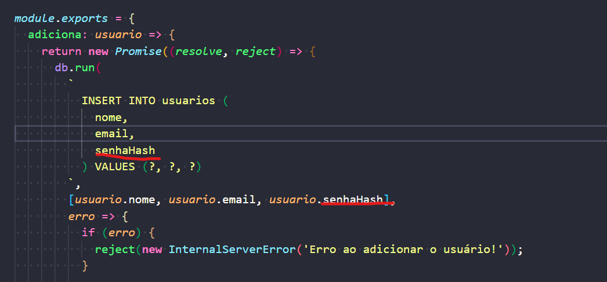
12. modificar arqvos database.js modificar esquema

   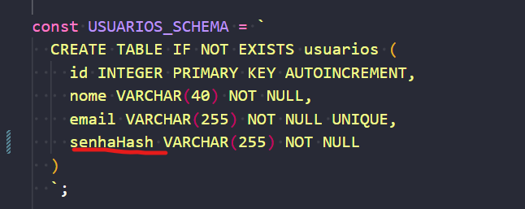
13. modificar controlador (/src/usuario/usuarios-controladores.js) e aidiocnado método adicionar

   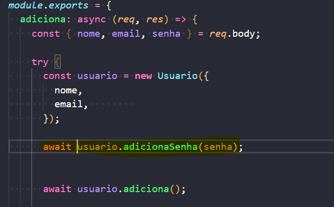
14. Instalação do npm install passport@0.4.1
15. npm install passport-local@1.0.0
16. configuração do da estrategia da configuração
16. criação do arquivo estrategias-autenticacao.js dentro de ./src/usuarios
17. configuração da stretegia de configuração

   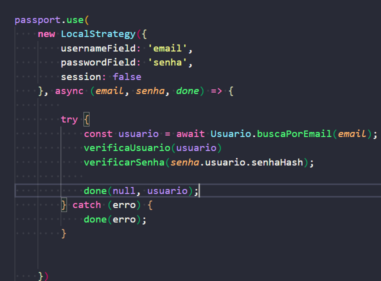
   
18. configuração das funções de verificaUsuario e VerfificarSenha

   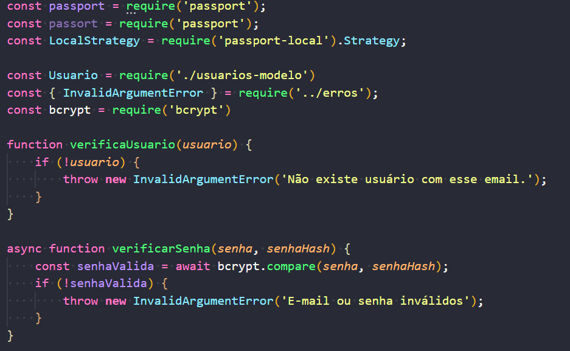

19. exportação do modulo estrategias-autenticancao dentro index na pats usuario.
20. incialização de estretgria-autenticação dentro do arquivo app.js
21. retorno de estatus dentro da pasta usuario-controlador

   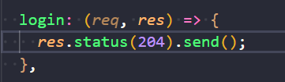

22. criação de nova rota dentro de usuario-rotas.js

   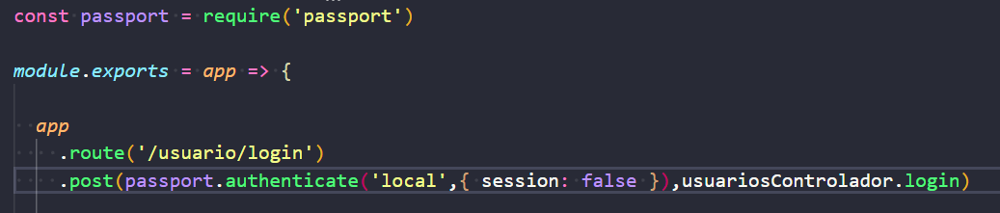

23. instalação do npm install jsonwebtoken@8.5.1
24. Criar uma função criaTokenJWT dentro de /src/usuario/usuarios-controlador.js

   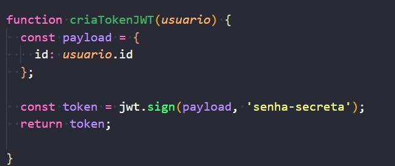

25. denttro da função de
26. guarda a senha em variavel de amibiente cria um arquivo .env na raiz do diretorio.
   27 instalação do pacote npm install dotenv@8.2.0 para lês as variaveis de ambiente.
27. importação da variavel dotenv no arquivo server.js

```js
require('dotenv').config();

const app = require('./app');
const port = 3000;
const db = require('./database');

const routes = require('./rotas');
routes(app);

app.listen(port, () => console.log(`App listening on port ${port}`));

```

29. chamar  variavel e ambiente de tro da função criaTokenJWT
30. instalação do npm install passport-http-bearer@1.0.1
31. configurado a a strategia de configuração do Bearer Token

~~~
  passport.use(
    new BearerStrategy(
      async (token, done) => {

        try {
          const payload = jwt.verify(token, process.env.CHAVE_JWT);
          const usuario = await Usuario.buscaPorId(payload.id);
          done(null, usuario)
          
        } catch (erro) {
          done(erro)
        }

      }
    )
  )
~~~

32. Inserir estretegias nas rotas posts-rotas.js
~~~
module.exports = app => {
  app
    .route('/post')
    .get(postsControlador.lista)
    .post(
      passport.authenticate('bearer',{session: false}),
      postsControlador.adiciona
    );
};
~~~

33. inserir na rota de usuario.

<
